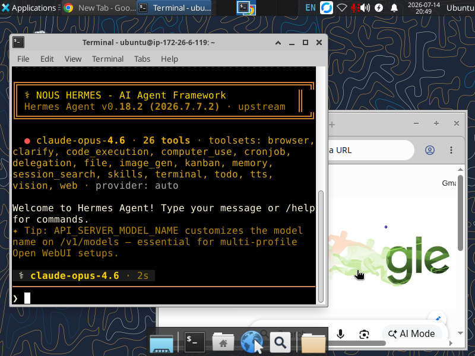

<div align="center">

# ☁️ Cloud Workstation

**Infrastructure as Code for reproducible Ubuntu development workstations.**

Provision a fresh Ubuntu machine into a fully configured, remote-accessible development environment with a single command.


</div>

---
<p align="center">
  
</p>

---

## 🚀 Overview

Cloud Workstation transforms a **fresh Ubuntu server** into a fully configured development workstation ready for remote engineering.

Its responsibility is intentionally limited to provisioning the **operating system** and **core infrastructure**.

Once the machine is ready, **Hermes** takes over and manages the developer experience, AI tooling, workflows, automation, and project operations.

```text
┌──────────────────────┐
│ Fresh Ubuntu 24.04   │
└──────────┬───────────┘
           │
           ▼
    ./bootstrap.sh
           │
           ▼
┌──────────────────────┐
│ XFCE Desktop         │
│ RustDesk             │
│ Browsers             │
│ Docker               │
│ Mise                 │
└──────────┬───────────┘
           │
           ▼
      🤖 Hermes Ready
```

---

# ✨ Features

* 🚀 One-command workstation provisioning
* 🔁 Fully reproducible infrastructure
* ⚙️ Infrastructure as Code
* 📦 Modular component architecture
* 🧩 Configuration-driven installation
* 🛡️ Idempotent installers
* 🔍 Built-in verification scripts
* ☁️ Optimized for AWS Lightsail
* 🐧 Ubuntu 24.04 LTS support
* 📚 Version-controlled infrastructure

---

# 🎯 Vision

Every development workstation should be:

| Principle             | Description                             |
| --------------------- | --------------------------------------- |
| 🔁 Reproducible       | Build identical machines every time     |
| 🤖 Automated          | Zero manual setup                       |
| 📚 Version Controlled | Infrastructure lives in Git             |
| ♻️ Recoverable        | Destroy and recreate anytime            |
| 📏 Consistent         | Every workstation behaves identically   |
| 🗑️ Disposable        | Machines should never become snowflakes |

> **No workstation should rely on undocumented manual configuration.**

A brand-new server should become production-ready simply by executing the bootstrap process.

---

# 📦 Project Status

| Property       | Value                 |
| -------------- | --------------------- |
| Version        | `v0.1`                |
| Status         | 🚧 Active Development |
| Platform       | Ubuntu 24.04 LTS      |
| Cloud Provider | AWS Lightsail         |
| Architecture   | Component-Based       |

---

# 🏗️ Architecture

```text
                    ☁️ Cloud Workstation

                     bootstrap.sh
                           │
                           ▼
                 🔧 Component Orchestrator
                           │
        ┌──────────────────┼──────────────────┐
        ▼                  ▼                  ▼

     🖥 System         🖼 Desktop        🛰 RustDesk

        ▼                  ▼                  ▼

     🌐 Browsers       🐳 Docker         📦 Mise

                           │
                           ▼

                       🤖 Hermes
```

---

# 🎭 Responsibilities

## ✅ Cloud Workstation Owns

Cloud Workstation is responsible for the machine itself.

* 🐧 Operating System
* 🖥 Desktop Environment
* 🛰 Remote Desktop
* 🌐 Networking
* 🌍 Browser Installation
* 🐳 Docker Engine
* 📦 Docker Compose
* ⚡ Mise Runtime Manager
* 🔧 Base Runtime Configuration

---

## ❌ Hermes Owns

Hermes is responsible for the developer experience.

* 🤖 AI Agents
* 💻 Claude Code
* 🛠 AI CLI Tools
* 🐚 Shell Customization
* 📁 Dotfiles
* 🔐 Git Configuration
* 🔑 SSH Configuration
* 📋 Development Workflows
* 📦 Project Templates
* 🏢 Business Automation

This separation keeps responsibilities clean and maintainable.

---

# 📁 Repository Structure

```text
cloud-workstation/
│
├── bootstrap.sh
│
├── components/
│   ├── system/
│   ├── desktop/
│   ├── rustdesk/
│   ├── browsers/
│   ├── docker/
│   ├── mise/
│   └── hermes/
│
├── configs/
│   ├── components.conf
│   └── packages/
│
├── docs/
│
└── lib/
```

---

# 🧩 Components

## 🐧 System

Responsibilities

* Update package index
* Install base packages
* Configure system essentials
* Verify installation

---

## 🖥️ Desktop

Responsibilities

* Install XFCE
* Install LightDM
* Configure desktop environment

---

## 🛰️ RustDesk

Responsibilities

* Install RustDesk
* Configure firewall
* Verify service
* Run diagnostics

---

## 🌐 Browsers

Responsibilities

* Install Google Chrome
* Install Firefox

---

## 🐳 Docker

Responsibilities

* Install Docker Engine
* Install Docker Compose Plugin
* Configure Docker service
* Configure non-root Docker access

---

## 📦 Mise

Responsibilities

* Install Mise
* Configure shell integration
* Install project runtimes

---

## 🤖 Hermes

Responsibilities

* Clone Hermes
* Bootstrap Hermes

Once Hermes begins execution, Cloud Workstation's responsibility ends.

---

# ⚙️ Bootstrap Process

```text
bootstrap.sh
      │
      ▼
Load Libraries
      │
      ▼
Read Component Manifest
      │
      ▼
Execute Components
      │
      ▼
Install
      │
      ▼
Verify
      │
      ▼
Continue
      │
      ▼
✔ Workstation Ready
```

---

# ⚙️ Configuration

Cloud Workstation is completely configuration-driven.

## 📋 Component Manifest

```text
configs/components.conf
```

Defines:

* execution order
* enabled components
* orchestration flow

---

## 📦 Package Definitions

```text
configs/packages/
```

Example:

```text
configs/packages/system.txt
configs/packages/desktop.txt
configs/packages/docker.txt
```

Installers never hardcode package names.

---

# 🚀 Installation

Clone the repository

```bash
git clone <repository-url>

cd cloud-workstation
```

Run the bootstrap process

```bash
./bootstrap.sh
```

The installer will execute every enabled component in sequence.

---

# ✅ Verification

Every component exposes its own verification script.

Example:

```bash
./components/system/verify.sh

./components/docker/verify.sh

./components/mise/verify.sh
```

Verification scripts are designed to be:

* ✅ Safe
* 🔁 Repeatable
* ⚡ Fast
* 🛡️ Idempotent

---

# 👨‍💻 Development Workflow

When adding a new component:

```text
Create Component
      │
      ▼
Implement install.sh
      │
      ▼
Implement verify.sh
      │
      ▼
Add Configuration
      │
      ▼
Register Component
      │
      ▼
Test on Fresh Machine
      │
      ▼
Commit
```

Every installer must be **idempotent**.

Running installers multiple times should never break the workstation.

---

# 🧠 Design Principles

## 🏗️ Infrastructure as Code

Every manual action should eventually become code.

---

## 🔁 Idempotency

Running installers multiple times should always produce the same result.

---

## ⚙️ Configuration over Hardcoding

```text
configs/
    Configuration

components/
    Logic
```

Configuration belongs in `configs/`.

Logic belongs in `components/`.

---

## 🧩 Small Components

Each component should own exactly one responsibility.

Avoid large installation scripts.

---

## 📚 Version Control

Everything required to reproduce the workstation belongs in Git.

---

## ♻️ Reproducibility

The entire workstation should always be reproducible:

```text
Launch Ubuntu
      │
Clone Repository
      │
Run bootstrap.sh
      │
Hermes Ready
```

---

# 🛠️ Maintenance

When adding new software:

1. Decide whether it belongs to Cloud Workstation or Hermes.
2. Infrastructure belongs here.
3. Developer tooling belongs to Hermes.
4. Avoid mixing responsibilities.

Keeping these layers separate simplifies long-term maintenance.

---

# 🔄 Recovery

Recovery should always follow the same predictable process.

```text
Provision Ubuntu
      │
Clone Repository
      │
Run bootstrap.sh
      │
Verify Components
      │
Clone Hermes
      │
Bootstrap Hermes
      │
Resume Development
```

No manual configuration should ever be required.

---

# 🛣️ Roadmap

## 🚧 v0.1

* ✅ Repository Foundation
* ✅ Bootstrap Engine
* ✅ System Component
* ✅ Desktop Component
* ✅ RustDesk Component
* ✅ Browser Component
* ✅ Docker Component
* ✅ Mise Component

---

## 🚀 v1.0

* 🤖 Hermes Bootstrap
* 🧪 Fresh Machine Validation
* 📖 Recovery Documentation
* ☁️ Lightsail Base Snapshot

---

# 🤝 Contributing

Before submitting changes:

* 🧩 Keep components independent
* 🔁 Maintain idempotency
* ⚙️ Prefer configuration over hardcoding
* 🧪 Test on a clean Ubuntu instance
* 📚 Update documentation when required

---

# 📄 License

This project is licensed under the **MIT License**.

---

# 🌍 Long-Term Vision

Cloud Workstation is the infrastructure layer of the **Createahead Engineering Platform**.

Its goal is **not** to become a complete developer environment.

Instead, it provides a reliable foundation by provisioning the operating system and core runtime.

Once the infrastructure is ready, **Hermes** becomes responsible for everything above the operating system.

```text
                    Createahead Platform

            ┌─────────────────────────────┐
            │      ☁️ Cloud Workstation    │
            │─────────────────────────────│
            │ Ubuntu                      │
            │ Desktop                     │
            │ Docker                      │
            │ Browsers                    │
            │ Mise                        │
            └──────────────┬──────────────┘
                           │
                           ▼
            ┌─────────────────────────────┐
            │         🤖 Hermes           │
            │─────────────────────────────│
            │ AI Agents                   │
            │ Developer Experience        │
            │ Workflows                   │
            │ Automation                  │
            │ Knowledge                   │
            └─────────────────────────────┘
```

This clear separation of concerns keeps the platform:

* 🚀 Easy to provision
* 🔁 Fully reproducible
* 🛡️ Reliable
* 📦 Modular
* ♻️ Recoverable
* 📈 Easy to evolve over time

**Infrastructure below. Intelligence above.**
